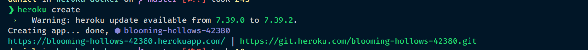

## Requisitos para rodar o projeto:

Você precisa ter o [docker](https://docs.docker.com/install/linux/docker-ce/ubuntu/) e o [heroku CLI](https://devcenter.heroku.com/articles/heroku-cli#download-and-install) para rodar e deployar o projeto:

 - [guia de instalação do docker](https://docs.docker.com/install/linux/docker-ce/ubuntu/)
 - [guia de instalação do Heroku CLI](https://devcenter.heroku.com/articles/heroku-cli#download-and-install)

## Depois de fazer as instalações use esses comandos para rodar o projeto:

### `sudo docker build -t pilula/docker:1.0 .`

Cria uma imagem docker localmente

### `sudo docker run -p 3000:3000 -d pilula/docker:1.0`

Cria um container doker apartir da imagem já criada 

### `sudo docker ps`

Mostra os container que estão rodando

## Deployar o container no heroku 

### `heroku login`

Faz o loguin no heroku

### `sudo docker ps`

É importante usar esse comando de nnovo para ter certesa que existe um container rodando

### `sudo heroku container:login`

Vai prepara o container para ser deployado 

### `heroku create` or `heroku create -a <app name>`

Cria um novo aplicativo no heroku, é importante prestar atenção no nome do aplicativo que o heroko criará, pois precisaremos dele na próxima etapa.

com a tag -a, você especifica qual nome de aplicativo sem ela o heroku cria um nome aleatório

No caso dessa imagem o nome do app é blooming-hollows-42380

### `sudo heroku container:push web -a <app name>`

Esse comando envia o conteiner da sua maquina pra o seu app no heroku

### `sudo heroku container:release web -a <app name>`

Esse comando faz o lançamento do app online

### `heroku open`

Vai direcionalo para o projeto deployado 

